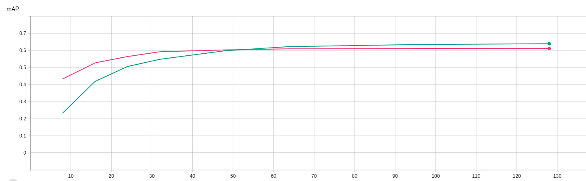

# Supervised Hashing with Latent Factor Model

论文[Supervised Hashing with Latent Factor Model](http://cs.nju.edu.cn/lwj/paper/SIGIR14_LFH.pdf)

## Requirements
1. pytorch 1.1
2. tb-nightly
3. tqdm
4. loguru

## 数据集下载地址
[cifar10-gist.mat](https://pan.baidu.com/s/1qE9KiAOTNs5ORn_WoDDwUg)

提取码: umb6

## 运行
`python run.py --dataset cifar10 --data-path <data_path> --code-length 64 `

日志记录在`logs`文件夹内

生成的hash code保存在`result`文件夹内，Tensor形式保存

## 参数说明
`dataset`: 使用数据集名称

`data-path`: 数据集文件路径

`code-length`: hash code长度

`num-samples`: 采样数量，（默认采样数量等于hash code length)

`max-iterations`: 迭代次数

`beta`: 超参，正态分布参数

`lamda`: 超参，Out-of-Sample Extension部分

`epsilon`： 控制迭代结束参数，代码里没有使用

## 实验
是否使用参数正则化对比，跑10次取平均，数据集cifar10-gist

红色是未使用正则化，绿色是使用正则化，横坐标取8, 12, 24...，代表bit

参数默认使用论文中提到的，正则化的作用可能仅在于对小数据集先搜索一个合适的超参，得到一个大致的范围，再在大数据集上搜索比较容易。
对于最终效果没有太大作用。
